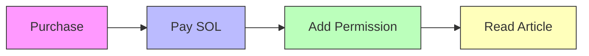

# Fluxor

Shared Economy Reading Platform

Where Readers, Authors, and Platform All Win

  
    Press Space to continue <carbon:arrow-right class="inline"/>
  

---
transition: fade-out
---

# The Problem: Traditional Paid Content Pain Points

<v-clicks>

## 📰 Traditional Model (e.g., New York Times)

### ❌ One-way Revenue
- **Platform** takes subscription fees
- **Authors** get fixed payments
- **Readers** pay only, no returns

### ❌ Centralized Control
- Platform controls distribution
- Readers can't participate in revenue
- Early supporters have no incentive

</v-clicks>

---
layout: two-cols
---

# Solution: Shared Economy Reading

::left::

## 🔄 Three-Way Win

**Authors** (50%)
- Earn on publish
- Auto revenue split

**Readers** (40%)
- Purchase = Investment
- Early readers earn passively

**Platform** (10%)
- Sustainable operations
- No content moderation needed

::right::

## 💡 Core Innovation

1. **Purchase = Investment**
   - Early buyers earn from subsequent buyers

2. **Backend-less Architecture**
   - Pure on-chain, frontend connects to DevNet

3. **Privacy Protection**
   - MagicBlock PER protects content

---
layout: center
class: text-center
---

# Why This Design?

## 📖 Reader Incentive

Discover quality content early,
purchase it, automatically earn
revenue from future readers

## ✍️ Author Incentive

No marketing needed,
readers actively promote
to earn revenue share

## 🌐 Decentralized

No content censorship,
no platform bans,
truly free publishing

---
layout: two-cols
---

# Revenue Distribution Mechanism

::left::

## 💰 Revenue Split

| Role | Share |
|------|-------|
| Platform | 10% |
| Author | 50% |
| Readers | 40% |

**The brilliance:**
- Readers become "distributors"
- Self-propagating mechanism
- Early discovery rewards

::right::

## 📊 Distribution Example

Assume article price **1 SOL**

| Buyer | Reader Pool | A's Reward | B's Reward |
|-------|-------------|------------|------------|
| A | 0 | 0 SOL | — |
| B | 1 | 0.4 SOL | 0 SOL |
| C | 2 | 0.2 SOL | 0.2 SOL |
| D | 3 | 0.13 SOL | 0.13 SOL |

**A Total: 0.73 SOL** | **B Total: 0.33 SOL**

*First purchase reader reward goes to author | B earns from 3rd purchase onward

---
layout: center
---

# Technical Architecture

## ⛓️ Solana L1

- Article registration
- Purchase payments
- Auto revenue distribution
- Reward claiming

**Public Data Layer**

## 🔐 MagicBlock PER

- Private article storage
- Permission control
- Only purchasers can read

**Privacy Data Layer**

---
layout: two-cols
---

# How MagicBlock Enables Privacy?

::left::

## 🔒 Technical Principles

1. **Delegation Model**
   - Article accounts delegated to PER
   - Encrypted data storage

2. **Permission Control**
   - Permission Account
   - Only authorized wallets can read

3. **Purchase = Authorization**
   - Transaction success auto-adds permission
   - No waiting required

::right::

---
layout: image-right
image: https://images.unsplash.com/photo-1555066931-4365d14bab8c?w=800
---

# MVP Features: Backend-less Architecture

## ✅ Implemented

### For Creators
- ✅ Publish Markdown articles
- ✅ Set price & purchase limit
- ✅ Update article content
- ✅ Claim earnings

### For Readers
- ✅ Browse article listings
- ✅ Purchase articles
- ✅ Read private content
- ✅ View revenue share
- ✅ Claim rewards

Frontend connects directly to DevNet, no backend services needed

---
layout: center
class: text-center
---

# Live Demo

🔗 <strong>fluxor-read-web.vercel.app</strong>

📝 <strong>Write Articles</strong>
- Markdown editor
- One-click publish
- Real-time preview

💰 <strong>Buy & Read</strong>
- Connect wallet
- One-click purchase
- Instant unlock

📊 <strong>Earnings Tracker</strong>
- Real-time revenue share
- One-click claim
- Transparent & verifiable

---
layout: two-cols
---

# Roadmap

::left::

## 🚀 v0.2 - Content Optimization

- Multi-account storage (500KB+ articles)
- Paginated indexing for scalability
- Improved chunking system

## 🚀 v0.3 - Payment Expansion

- USDC / USDT support
- Multi-currency pricing
- Article version history
- Batch reward claiming

::right::

## 🚀 v0.4 - Social Features

- Comments & reactions
- Follow authors
- Reading history
- Personal library

## 🚀 v1.0+ - Ecosystem

- Tipping functionality
- Image & video upload
- Subscription model
- Mobile applications

---
layout: center
class: text-center
---

# Core Competitive Advantage: Anti-Piracy Game Theory

## 🎯 Traditional Piracy Problem

<v-clicks>

### ❌ Single Purchase, Infinite Distribution
- One person buys, screenshots and shares
- Readers have no incentive to stop piracy
- Authors suffer massive losses

### ❌ Early Readers Indifferent
- Already consumed the content
- Sharing costs them nothing
- Might even gain "reputation"

</v-clicks>

## 🛡️ Fluxor's Solution

<v-clicks>

### ✅ Early Readers Have Revenue Share
- Earlier purchase = more future earnings
- Piracy = losing their own revenue

### ✅ Readers Game Theory
- Early readers actively prevent piracy
- Even promote genuine copies
- "I bought, you buy too, I earn money"

</v-clicks>

<v-click>

## 💡 The Brilliance: Turn Pirates into Copyright Guardians

Early readers are no longer uninterested parties — they're **copyright stakeholders**

</v-click>

---
layout: center
class: text-center
---

# Core Value Proposition

## 🎯 For Readers

Early discovery = Passive income
 
Purchase = Investment

## ✍️ For Authors

Auto-promotion mechanism
 
Focus on creation
 
Anti-piracy protection

## 🌐 Decentralized

No platform censorship
 
Complete freedom

---
layout: center
class: text-center
---

# Universal Applicability

**Beyond Articles — Any Digital Content**

## The Core Pattern

> **Any valuable, distributable digital content with paywall access can use this mechanism.**

### 📚 Knowledge Content
- Research reports
- Online courses
- Investment strategies
- Tutorials & guides

### 💻 Developer Tools
- Code libraries
- API access
- Design resources
- UI components

### 🎨 Creative Content
- Music & audio
- Photography
- Game assets
- Video content

### 📊 Data Services
- Datasets
- Research data
- Analytics data
- Training data

**Core Innovation:** Transform "early buyers" into "promoters" and "consumption" into "investment."

---
layout: center
class: text-center
---

# Truly Free Content Creation

🚀 <strong>Fluxor - Shared Economy Reading Platform</strong>

Early Readers = Early Investors

<strong>fluxor-solana.github.io</strong>

---
layout: end
---

# Thank You

## 🤝 Let's Connect

Welcome to discuss technical details
and business model exploration

GitHub: github.com/LixvYang/fluxor-solana

## 📊 Tech Stack

- **Solana** — Public data layer
- **MagicBlock** — Privacy compute layer
- **Anchor** — Smart contract framework
- **React** — Frontend framework

# Q & A

