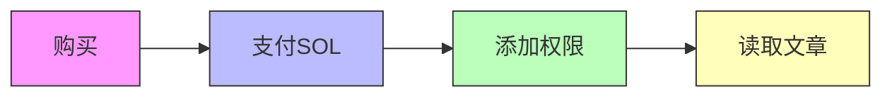

# Fluxor

共享经济阅读平台

让读者、作者、平台三方共赢

  
    按空格键继续 <carbon:arrow-right class="inline"/>
  

---
transition: fade-out
---

# 问题：传统付费阅读的痛点

<v-clicks>

## 📰 传统模式（如纽约时报）

### ❌ 单向收益
- **平台** 收取订阅费
- **作者** 获得固定稿酬
- **读者** 只付钱，无回报

### ❌ 中心化控制
- 平台决定内容分发
- 读者无法参与收益
- 早期支持者无激励

</v-clicks>

---
layout: two-cols
---

# 解决方案：共享经济阅读

::left::

## 🔄 三方共赢

**作者** (50%)
- 发布即收益
- 自动分账

**读者** (40%)
- 购买即投资
- 早期读者躺赚

**平台** (10%)
- 可持续运营
- 无需内容审核

::right::

## 💡 核心创新

1. **购买 = 投资**
   - 早期购买者获得后续购买者分润
   
2. **无后端架构**
   - 纯链上，前端直连 DevNet
   
3. **隐私保护**
   - MagicBlock PER 保护正文

---
layout: center
class: text-center
---

# 为什么这样设计？

## 📖 读者激励

早期发现好文章，
购买后自动获得
后续读者分润

## ✍️ 作者激励

无需营销，
读者主动传播
赚取分润

## 🌐 去中心化

无内容审查，
无平台封杀，
真正自由发布

---
layout: two-cols
---

# 分润机制设计

::left::

## 💰 收益分配

| 角色 | 比例 |
|------|------|
| 平台 | 10% |
| 作者 | 50% |
| 读者 | 40% |

**精妙之处：**
- 读者成为"分销商"
- 自传播机制
- 早期发现奖励

::right::

## 📊 分润示例

假设文章价格 **1 SOL**

| 购买者 | 读者池 | A的奖励 | B的奖励 |
|--------|--------|---------|---------|
| A | 0人 | 0 SOL | — |
| B | 1人 | 0.4 SOL | 0 SOL |
| C | 2人 | 0.2 SOL | 0.2 SOL |
| D | 3人 | 0.13 SOL | 0.13 SOL |

**A 总计：0.73 SOL** | **B 总计：0.33 SOL**

*第一笔购买的读者奖励归作者 | B从第3笔购买才开始获得分润

---
layout: center
---

# 技术架构

## ⛓️ Solana L1

- 文章注册
- 购买付款
- 自动分账
- 收益 claim

**公开数据层**

## 🔐 MagicBlock PER

- 隐私文章存储
- 权限控制
- 只有购买者可读

**隐私数据层**

---
layout: two-cols
---

# MagicBlock 如何实现隐私？

::left::

## 🔒 技术原理

1. **委托模式**
   - 文章账户委托到 PER
   - 数据加密存储

2. **权限控制**
   - Permission Account
   - 只有授权钱包可读

3. **购买即授权**
   - 交易成功自动添加权限
   - 无需等待

::right::

---
layout: image-right
image: https://images.unsplash.com/photo-1555066931-4365d14bab8c?w=800
---

# MVP 功能：无后端架构

## ✅ 已实现

### 创作者
- ✅ 发布 Markdown 文章
- ✅ 设置价格和购买上限
- ✅ 更新文章内容
- ✅ Claim 收益

### 读者
- ✅ 浏览文章列表
- ✅ 购买文章
- ✅ 阅读隐私内容
- ✅ 查看分润
- ✅ Claim 奖励

前端直连 DevNet，无需任何后端服务

---
layout: center
class: text-center
---

# Live Demo

🔗 <strong>fluxor-read-web.vercel.app</strong>

📝 <strong>写文章</strong>
- Markdown 编辑器
- 一键发布
- 实时预览

💰 <strong>购买阅读</strong>
- 连接钱包
- 一键购买
- 即时解锁

📊 <strong>收益追踪</strong>
- 实时分润
- 一键 Claim
- 透明可查

---
layout: two-cols
---

# 路线图

::left::

## 🚀 v1.0 - 智能后端

- AI 文章分类
- 智能推荐
- 搜索功能
- 热门榜单

## 🚀 v2.0 - 社交功能

- 点赞/评论
- 关注作者
- 阅读历史
- 书架管理

::right::

## 🚀 v3.0 - 增强收益

- 打赏功能
- 打赏增加分润比例
- USDC 支付
- 多货币支持

## 🚀 v4.0 - 内容生态

- 图片上传
- 视频嵌入
- 系列文章
- 订阅制

---
layout: center
class: text-center
---

# 核心竞争优势：反盗版博弈

## 🎯 传统盗版问题

<v-clicks>

### ❌ 单次购买，无限传播
- 一人购买，截图分享
- 读者无激励阻止盗版
- 作者损失惨重

### ❌ 早期读者无所谓
- 反正已经看过内容
- 分享给别人无损失
- 甚至可能获得"好评"

</v-clicks>

## 🛡️ Fluxor 的解决方案

<v-clicks>

### ✅ 早期读者有分润权
- 购买越早，后续收益越大
- 盗版 = 损失自己的收益

### ✅ 读者相互博弈
- 早期读者主动阻止盗版
- 甚至主动推广正版
- "我买了，你也买，我有钱赚"

</v-clicks>

<v-click>

## 💡 精妙之处：让盗版者成为正版守护者

早期读者不再是无利益相关者，而是**版权利益共同体**

</v-click>

---
layout: center
class: text-center
---

# 核心价值

## 🎯 读者

早期发现 = 被动收入
 
购买即投资

## ✍️ 作者

自动传播机制
 
专注创作
 
反盗版保护

## 🌐 去中心化

无平台审查
 
完全自由

---
layout: center
class: text-center
---

# 让内容创作真正自由

🚀 **Fluxor - 共享经济阅读平台**

早期读者 = 早期投资者

**在线体验**
fluxor-read-web.vercel.app

---
layout: end
---

# 感谢聆听

## 🤝 交流

欢迎交流技术细节
和商业模式探讨

## 📊 技术栈

- **Solana** - 公共数据层
- **MagicBlock** - 隐私计算层
- **Anchor** - 智能合约框架
- **React** - 前端框架

# Q & A

